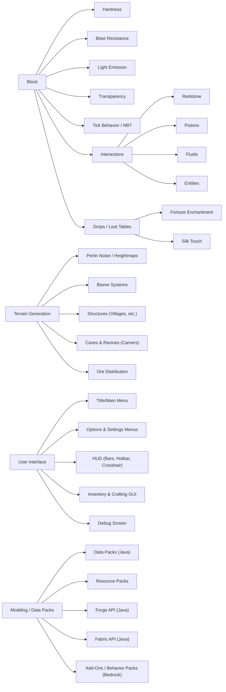

# Executive Summary  
Minecraft’s world is built from **blocks**—1m³ units arranged in a 3D grid that make up terrain and structures【1†L356-L364】. Blocks vary widely (natural blocks like stone, ores, wood; technical blocks like furnaces and redstone components; decorative blocks; fluids; and special blocks) and are classified by material and function. Each block has attributes (hardness, blast resistance, light emission, transparency, collision, tick behavior and NBT data) that govern its behavior and interactions.  Blocks can emit light (e.g. glowstone, lantern), be transparent or opaque (glass vs. stone), have gravity (sand, gravel fall), and complex states (doors open/closed, oriented logs).  They interact via game systems: **Redstone** circuits (power sources, wires, repeaters, comparators, torches, switches) allow logic and automation【16†L276-L284】; **Pistons** move blocks and entities (with regular pistons pushing blocks and sticky pistons also pulling)【17†L79-L87】【17†L91-L95】; **Fluids** (water and lava) flow in “diamond” patterns with depth-based mechanics and interact to form stone, cobblestone, obsidian, or basalt depending on configuration【20†L394-L402】【22†L543-L552】.  Many blocks have drops defined by loot tables: e.g. ores drop resources (diamond yields diamonds, iron yields raw iron) unless mined with **Silk Touch** to drop the block itself【26†L341-L350】.  **Tools** (pickaxe, axe, shovel, etc.) are effective on certain blocks and yield drops faster. Enchantments modify block interactions: *Fortune* increases drop quantities from ores and plants (e.g. flint from gravel)【42†L517-L525】, while *Silk Touch* causes blocks to drop themselves (stone rather than cobblestone, glass intact, etc.)【41†L398-L407】【42†L543-L549】; these two are mutually exclusive【41†L479-L483】【42†L543-L549】.  

**Terrain generation** uses layered noise algorithms and procedural rules.  In modern Java Edition (1.18+), Overworld terrain is generated by Perlin/Simplex noise (“low” and “high” noise layers blended by a selector function) to shape mountains, hills, and valleys【52†L386-L394】【52†L398-L404】.  Additional noises (depth noise, weirdness noise, etc.) create variation in biome surfaces.  The **biome system** uses a multi-dimensional climate model: each location has *Temperature*, *Humidity*, *Continentalness*, *Erosion*, *Weirdness*, and *Depth* values, which determine biome placement according to preset ranges【62†L35-L42】.  (For example, very cold low-humidity areas become snowy tundra.)  In Java 1.18 (“Caves & Cliffs” update), the biome system was overhauled so biomes no longer directly control elevation【63†L3088-L3091】.  Beyond biomes, Minecraft places **structures** (villages, strongholds, mineshafts, temples, etc.) via separate algorithms: villages and temples spawn on surface biomes at configured spacing, strongholds generate underground in concentric rings around world spawn, and simple “carvers” algorithmically tunnel out **caves** and ravines (using a “perlin worm” random walk)【55†L212-L220】.  **Ore distribution** is done in clusters: each ore type has a defined vein size, frequency, and altitude distribution (uniform or triangular).  For instance, diamond ore in 1.18+ generates in veins (size ~7) with a triangular bias toward deep layers (roughly Y≈–64 to +16)【73†L1-L4】【74†L12-L15】.  Different **world types** exist (Default, Superflat, Large Biomes, Amplified, Customized), and Java vs. Bedrock have some differences (e.g. separate world height limits and some biome distinctions).  

The **user interface (UI)** comprises the title/main screen, menus, HUD, inventory/crafting screens, debug info, and accessibility options.  The title screen (Java “main menu”) shows the Minecraft logo, a random “splash” text, and a rotating background panorama【83†L282-L289】.  Java’s main menu has buttons for **Singleplayer, Multiplayer, Realms, Language, Options, Quit**, plus an Accessibility button【83†L311-L319】.  Bedrock’s main menu is similar but labeled “Play” (world selection), “Settings”, “Marketplace” for add-on content, “Editions” (switching edition on consoles), and sign-in options【109†L332-L340】.  The HUD (Heads-Up Display) overlays gameplay: in survival mode it shows health (hearts), hunger, armor, oxygen (when underwater), experience, and the hotbar (inventory slots 1–9)【85†L317-L324】【114†L349-L356】.  The crosshair reticle is centered on-screen【85†L317-L324】.  Chat messages appear at bottom (Java) or top (Bedrock) of HUD【114†L329-L332】.  Creative mode hides health/hunger bars【114†L327-L332】.  The inventory screen (opened by `E`) shows 27 storage slots, a 2×2 crafting grid, 4 armor slots, a hotbar, and one offhand slot【87†L337-L344】.  A crafting table GUI expands this to a 3×3 grid.  The debug screen (F3) overlays technical data: game version, FPS/memory, player coordinates, chunk info, facing, light levels, local difficulty, etc.【90†L300-L304】.  Accessibility options include UI scaling, text opacity, subtitles (for ambient sounds), narrator/screen-reader, and touchscreen layouts (Bedrock) to support players with impairments.

Minecraft is highly moddable. **Data Packs** (Java) and **Add-On packs** (Bedrock) allow customizing behaviors without code.  Data packs are file structures containing JSON (for loot tables, recipes, structures, functions, tags, predicates, dimensions, etc.)【94†L35-L39】, enabling server and world customization.  **Resource Packs** replace textures, models, sounds, and language files.  On Java, popular **modding APIs** like **Forge** and **Fabric** enable Java-based mods (Forge is a mature open-source API【103†L211-L214】; Fabric is a lightweight 1.14+ modding toolchain【105†L46-L49】).  Bedrock supports “Behavior Pack” and “Resource Pack” add-ons that alter entity behavior and assets【101†L47-L51】.  

Below is a conceptual diagram of Minecraft’s systems and how they interconnect (blocks, terrain, UI, mods, etc.):

## Block Taxonomy and Properties  
Blocks in Minecraft fall into broad categories by material and function: **Natural blocks** (stone, dirt, water, vegetation), **Ores** (coal, iron, diamond, redstone, etc.), **Building/decorative** (wood planks, bricks, glass, concrete, terracotta), **Utility/functional** (crafting table, furnace, anvil, chests, enchantment table), **Redstone components** (dust, torches, repeaters, pistons), **Fluid blocks** (water, lava), and others (bedrock, barrier, air as empty space). Every block has intrinsic **properties**:  
- **Hardness** (mining time): e.g. stone = 1.5, wood = 2, obsidian = 50, bedrock = ∞. Hardness determines tool required and break speed.  
- **Blast resistance**: how well it withstands explosions (TNT, creepers). High for obsidian, low for glass.  
- **Luminance**: blocks may emit light (glowstone=15, torch=14, sea lantern=15) or not (stone=0).  
- **Transparency**: opaque blocks completely block light and redstone (e.g. stone), transparent blocks (glass, water) allow light through. Some **semi-transparent** (leaves, slabs) partly block.  
- **Collision/bounding box**: most blocks fill a cube, but some are partial (slabs, stairs), non-solid (flowers), or intangible (air). This affects where entities collide and redstone can transmit.  
- **Tick behavior / NBT**: Blocks may have tile-entity data (furnace, chest, signs have inventories or text) or scheduled updates (flowers wilt with water update, blocks like TNT have delayed fuse).  

For example, wool is a soft block (hardness=0.8, low blast resistance), whereas obsidian is extremely hard (requires diamond tools, blasts resistance ~1,200). Water and lava flow as fluids with special depth and flow rules【20†L394-L402】. Many blocks (leaves, crops) respond to random ticks (for growth or decay). Tools are effective on matching materials (axes on wood, pickaxes on stone/ore, shovels on dirt/sand).  

Block **states** add variants without separate IDs: e.g. wool color, log axis orientation, door open/closed. Each state influences appearance, collision, or functionality. Blocks may also have **NBT data** for dynamic content (e.g. chests store inventory, spawners store entity type, shulker boxes store items).  

## Block Interactions (Redstone, Pistons, Fluids, Entities)  
**Redstone System:** Redstone is Minecraft’s “electrical” system. Redstone components include power sources (redstone torches, buttons, levers, pressure plates), transmission (dust, repeaters for delay, comparators for signal strength measurement) and devices (redstone lamps, dispensers, pistons)【16†L276-L284】.  Power propagates in a grid, powering adjacent blocks. Redstone dust carries power level (0–15); a redstone torch inverts signal.  Repeaters extend range/delay, comparators can subtract signals or maintain strength (useful for item-based comparators on containers).  Mechanisms like doors, pistons, note blocks respond to redstone power. (Notably, opaque blocks can carry redstone currents; transparent blocks generally do not.) This system enables complex contraptions (clocks, calculators, farms).  

**Pistons:** Pistons push and pull blocks. A **regular piston** pushes the block in front of it when powered (extending up to 12 blocks chain)【17†L91-L95】; a **sticky piston** does the same but also pulls the rearmost block back when unpowered【17†L91-L95】. Pistons impart momentum to entities, moving mobs or items. Some blocks cannot be moved (bedrock, end portal frames), and some break when pushed (flowers, torches drop as items)【17†L97-L104】. Pistons do not rotate blocks (bedrock is an exception), and redstone updates control their timing. They enable doors, elevators, block-swapping machines, etc.  

**Fluids:** Water and lava flow according to Minecraft’s fluid rules【20†L394-L402】. A source block spreads outward, creating a diamond-shaped flow pattern (water up to 7 blocks from source)【20†L394-L402】. Flow speeds differ: water moves 1 block/5 ticks (4 blocks/sec), lava moves 1/30 ticks (0.067 blocks/sec in Overworld) or 1/10 ticks (Nether lava)【20†L463-L468】. When fluids meet, they form blocks: flowing lava into water yields cobblestone; water into lava forms obsidian; falling water on lava forms obsidian【22†L543-L552】 (shown below). Soul soil under lava with blue ice makes basalt【22†L555-L557】. Bubble columns form in water over soul sand or magma blocks, affecting entity buoyancy. Fluids update and convert flowing states, influencing generation of lakes and caverns.  

**Entities:** Blocks and entities interact in many ways. Some blocks (crops, saplings, flowers) require random block ticks to grow or spread. **Falling blocks** (sand, gravel, concrete powder) become entity forms when unsupported. Mobs spawn on valid block surfaces (grass, stone for monsters at low light). Pressure plates detect entity presence. Cacti and magma hurt mobs. Fires spread to flammable blocks. Pressure triggers in redstone often use blocks (plates, observers).  

## Crafting, Smelting, Drops, Tools, Enchantments  
**Crafting:** The recipe system uses shaped and shapeless recipes. In inventory or crafting table GUIs, players arrange items into grids (2×2 in inventory, 3×3 in a crafting table) to create new items【35†L291-L299】【35†L345-L354】. For example, placing wood planks in a row makes sticks (shapeless), while specific patterns (two wood, two sticks) make pistons (shaped)【35†L291-L299】【35†L345-L354】. The recipe book (in GUI) categorizes recipes (building blocks, tools, redstone, etc.). Crafting is instantaneous and does not consume fuel.  

**Smelting:** Furnaces (and variants like blast furnaces, smokers) cook items with fuel【24†L333-L342】. A regular furnace smelts one item per 10 seconds (200 ticks)【24†L333-L342】; blast furnaces/smokers do it in 5 seconds (double speed) for ores and food, respectively【24†L389-L393】. All vanilla smelting recipes work (e.g., iron ore → raw iron, raw food → cooked). Experience orbs are given for each smelt. Lava buckets, coal, charcoal, wood, etc., are fuel sources (each item burns for a set number of ticks). Ores can be automatically cooked via hoppers and auto-refineries.  

**Loot Tables and Drops:** Drops from blocks and chests are controlled by data-driven **loot tables**【37†L282-L289】. For example, stone blocks drop cobblestone unless Silk Touch is used. Ores drop resources: Coal ore → coal; Iron ore → raw iron (1); Diamond ore → diamond (1); Redstone ore → 4–5 redstone dust; Lapis ore → 4–9 lapis; Emerald ore → emerald; Nether quartz ore → quartz【26†L341-L350】.  Silk Touch causes blocks to drop themselves (stone block instead of cobblestone, ore block instead of resource). Fortune (level I–III) increases quantities: e.g. Fortune III gives up to 4 diamonds per diamond ore (instead of 1), 100% flint from gravel, more drops from plants (saplings, seeds), gold nuggets from blackstone, etc.【42†L517-L525】.  Conversely, smelting an ore (e.g. silk-touch a coal ore → block → smelt) only yields 1 item and less XP, so mining normally yields more resources on ore types that drop multiples【26†L373-L379】. Containers (chests, furnaces, mob drops) also use loot tables (e.g. dungeon chests, fishing) to randomize contents【37†L282-L289】.  

**Tool Effectiveness and Enchantments:** Each tool type works faster on matching materials (pickaxes on stone/ores, axes on wood, shovels on dirt/gravel). Using the wrong tool yields no speed bonus and may drop nothing. Tools have durability that decreases per use (unless Unbreaking enchantment prolongs it).  Enchantments affect blocks: *Efficiency* (all tools) increases mining speed; *Silk Touch* (as above) preserves blocks; *Fortune* (as above) multiplies drops; *Unbreaking* reduces wear; *Mending* repairs with experience. For example, efficiency IV diamond pickaxe mines stone in one hit, Fortune III on gravel yields flint every time, etc.  

## Terrain Generation Algorithms and Biomes  
Minecraft generates terrain in **chunks** (16×16 block columns). **Heightmaps:** Java Edition uses multiple layers of noise. A “low-frequency” (large-scale) Perlin noise determines broad elevation (hills/valleys)【52†L386-L394】, and a “high-frequency” noise adds fine detail (cliffs, roughness). A selector noise blends these: values above 1 pick the high-detail noise, below 0 pick the low, between 0–1 linearly blends【52†L398-L404】. A small “depth” noise further modulates small altitude variations【52†L409-L417】. This generates the height of bedrock, earth, and stone layers.  Surface blocks (grass, sand, etc.) are then placed according to biome rules. 

**Biomes:** Regions have specific climate values. In current Java generation, each chunk point has 6 parameters (Temperature, Humidity, Continentalness, Erosion, Weirdness, Depth) generated by noise【62†L35-L42】. Biomes are chosen from this 6D “noise” space: e.g. Desert biomes are high temperature, low humidity; Mountains are high erosion; Oceans have high continentalness (deep).  This multi-noise approach (post-1.18) replaced the old simpler climate grid. Biomes dictate surface blocks (grass, sand, ice) but in recent updates no longer force terrain height【63†L3088-L3091】.  

**Structures:** Special generation algorithms place structures: villages spawn on plains/deserts/savannas/etc. at set grid intervals, using template buildings; strongholds are placed in 3 concentric rings about spawn; mineshafts, woodland mansions, temples, and monuments spawn randomly with fixed frequency. In caves, special “carvers” dig tunnels and canyons (prior to 1.18, a 3D noise called “perlin worms”; in 1.18+ even more cave biomes like lush or dripstone caves exist). Each structure has a height or biome requirement. For instance, villages will not generate underwater or in oceans.  

**Ore & Feature Generation:** During world gen, the game places veins of ores and features according to rules. Each ore uses either **uniform** or **triangular** distribution【73†L1-L4】. Uniform means equal chance at all heights; triangular means a peak height with fewer on edges. For example, diamond ore (Java 1.18+) uses a triangular distribution favoring deep layers【73†L1-L4】 (center ~Y=-58), generating clusters of ~7 blocks【74†L12-L15】. Coal and iron spawn more evenly in stone (uniform from bedrock to mid-level). Lapis spawns rarely near bedrock in wider veins. Gold, copper, redstone have specific bands.  In lush caves, dripstone caves, and other new cave biomes, ores appear similarly but on the modified terrain.  **Surface features** like trees, lakes, vegetation, and snow are placed after terrain: each biome type has rules (e.g. oak trees in forests, cacti in deserts, ice in cold biomes).  

**Version Differences:** Java vs. Bedrock have some differences in algorithms (Bedrock used a different noise set for a while, and biome layouts differ slightly). Major updates include The Nether Update (1.16, added Nether biomes and blocks) and Caves & Cliffs (1.18, doubled world height and revived old terrain at Y=-64 to +320【63†L3088-L3091】). In summary tables, a few key changes are:  

| Feature                        | Java Pre-1.18                 | Java 1.18+                   | Bedrock (current)                     |
|--------------------------------|-------------------------------|------------------------------|---------------------------------------|
| World Height Range             | 0 to 256                      | -64 to +319 (total height)   | -64 to +320                           |
| Biome Generation Parameters    | 4-climate (temp, rainfall)    | 6-parameter multi-noise【62†L35-L42】 | Separate climate vs humidity (older Bedrock), now also 6D similar |
| Cave Generation                | 3D Perlin (early), **worms** later【55†L212-L220】 | **Worms + Cave Biomes** (lush, dripstone) | Similar worm tunnels, fewer cave biomes |
| Ore Depth Distributions        | Uniform/linear (old)          | Triangular for many ores【73†L1-L4】 | Mostly similar, but Java’s deep slate layer absent |
| Structures (villages, etc.)    | Biome-based, fixed grid       | Similar; new villages styles in 1.14+ | Village templates differ (e.g. Ohio Ohio) |
| Biome Variety                  | ~70 biomes (1.16)             | >80 (after 1.19)             | Fewer variants historically, now ~90 with updates |

## User Interface: Menus and HUD  
**Title/Main Menu:** Upon launch or quit-to-menu, Minecraft shows the title screen. Java Edition’s title screen displays the large **Minecraft** logo with a random yellow *splash* subtitle, and a dynamic panorama background【83†L282-L289】. Buttons are aligned vertically: *Singleplayer* (world select), *Multiplayer* (server list), *Minecraft Realms*, *Options*, *Language*, *Accessibility*, and *Quit Game*【109†L311-L319】. The Options menu leads to keybindings, video/sound settings, resource packs, etc.  Bedrock’s menu is similar but starts with *Play*, *Settings*, *Marketplace*, *Editions* (console only), *Dressing Room* (skins), and sign-in options for Xbox Live【109†L332-L340】.  

**Pause Menu:** In-game, pressing `Esc` or menu button shows game and chat options (Resume, Options, Save & Quit to Title, etc.). The debug screen (`F3` on Java) overlays performance and technical data【90†L300-L304】.

**Heads-Up Display (HUD):** The HUD is active during gameplay. In Survival/Adventure it shows (see image below) health (10 hearts), hunger (10 shanks), experience bar (green) at bottom, armor icons above health if wearing armor, oxygen bubbles above hunger when underwater【114†L317-L324】. The **hotbar** at bottom displays the currently carried items (slots 1–9)【114†L349-L357】.  A small crosshair is centered on-screen for aiming. The player’s selected hotbar item name appears briefly when switching【114†L349-L357】. On Bedrock (Pocket UI), health/armor bars shift to top-left, hunger/oxygen to top-right【114†L317-L324】. Creative mode removes the health, hunger, and oxygen bars【114†L327-L332】.  **Chat and Overlays:** Chat text and command output appear in a corner (Java: bottom-left; Bedrock: top-left)【114†L329-L332】. Other overlays include boss health bars, status effect icons (top-right, with potion effects flashing when near expiry)【114†L412-L419】, and optional debug info.  

**Inventory & Crafting UI:** Press `E` to open the inventory: a graphical interface showing 27 storage slots, a 2×2 crafting grid (Craft on the Go), 4 armor slots, the offhand slot, and the hotbar【87†L337-L344】. In survival this GUI has your skin shown on the left. Drag-and-drop and shift-click moves items. The player can craft any recipe fitting the 2×2 grid here (except “table-only” recipes requiring 3×3). Using a placed crafting table expands a separate GUI with a 3×3 grid (and one can craft anything therein). The creative inventory is a full-screen tabbed GUI categorizing every item.  

**Accessibility Options:** The game provides UI options such as text-to-speech **Narrator** (reads chat and UI), subtitle captions for sounds, GUI scale (auto/small/normal/large), text background opacity, view bobbing, and split controls (touch screens) to aid accessibility. (E.g., in Java the Narrator toggles with `Ctrl+B`.)

## Modding and Add-Ons  
Minecraft supports customization via **packs and APIs**.  

- **Data Packs (Java):** Introduced in 1.13, these are ZIP folders placed in a world’s `datapacks` directory. They contain JSON files (under `data/<namespace>/`) for **advancements, loot_tables, recipes, structures, functions, tags, predicates, worldgen** and more【94†L35-L39】.  Data packs can add new content or overwrite vanilla: custom ore veins, structures, crafting recipes, loot in chests, game rules, etc. (Mojang provides an example tutorial on data pack creation.)  

- **Resource Packs:** These replace game assets. A resource pack (RP) folder contains an `assets/` directory mirroring the `minecraft:` namespace. Textures (PNG), block models (JSON), sound files (OGG), language files, fonts, and GUI layout files can be changed. By installing an RP, players can change appearance (HD textures, UI theme) and sounds. Resource packs are identified by a `pack.mcmeta` file (format version tied to game version)【98†L485-L494】.  

- **Forge/Fabric (Java mods):** For full code mods, developers use mod loaders. **Minecraft Forge** is a long-established modding API (Java 1.0+) providing hooks into game code【103†L211-L214】. **Fabric** is a lightweight alternative for 1.14+【105†L46-L49】. Mods written for these (e.g. IndustrialCraft, Botania) can add blocks, items, entities, dimensions, and alter logic. Forge mods and Fabric mods use the above JSON packs under the hood (they also use data packs and resource packs) but allow writing Java to change behavior arbitrarily.  

- **Bedrock Add-Ons (PE/Win10):** Bedrock Edition uses **Behavior Packs** and **Resource Packs**. A behavior pack contains JSON files defining entity behaviors, loot tables, spawn rules, new items or blocks, and recipes【101†L47-L51】. It is combined with a resource pack for visuals. The official documentation encourages creating add-ons using Mojang’s tools. Unlike Java, Bedrock does not have an equivalent to Forge (though third-party Bedrock modding tools exist).  

The table below summarizes how some block and algorithm properties changed across versions:

| Feature                   | Pre-1.18 Java                   | Java 1.18+                     | Bedrock                       |
|---------------------------|---------------------------------|-------------------------------|-------------------------------|
| World Height (Y-levels)   | 0 to 256                        | –64 to +319【63†L3088-L3091】      | –64 to +320                    |
| Biome System              | 4-climate noise (temp, rain)    | Multi-noise 6D climate【62†L35-L42】 | Similar 4D (older) vs 6D now    |
| Ore Depth (Diamonds)      | Uniform ~Y=0–16 (sparsely)      | Triangular peak deep (~Y=–58)【73†L1-L4】 | Triangular, but world bottom = -64 |
| Cave Carving              | 3D perlin (“worms”)             | Additional cave biomes (lush) | Similar worms, fewer cave biomes |
| Villages                  | Fewer biomes (plains/desert)    | More biomes (savanna, snowy)  | Templates differ (e.g. farm vs hamlets) |
| Title Screen (UI)         | Logo + splash text + panorama【83†L282-L289】 | Same format (splash random)   | Similar with marketplace ad   |

## Sources  
This report draws on official documentation and the Minecraft Wiki for technical details (e.g. block behaviors【1†L356-L364】, redstone circuitry【16†L276-L284】, piston mechanics【17†L79-L87】【17†L91-L95】, fluid rules【20†L394-L402】【22†L543-L552】, crafting/smelting mechanics【35†L291-L299】【24†L333-L342】, loot and enchantment systems【26†L341-L350】【42†L517-L525】, terrain algorithms【52†L386-L394】【62†L35-L42】, and UI elements【83†L282-L289】【85†L317-L324】【114†L349-L357】).  Additional details on modding (Forge, Fabric, data/resource packs) come from their documentation【94†L35-L39】【103†L211-L214】【105†L46-L49】【101†L47-L51】. 

